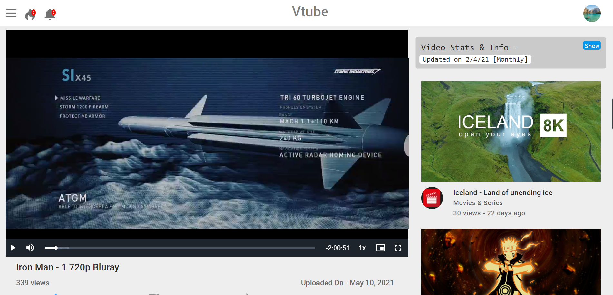
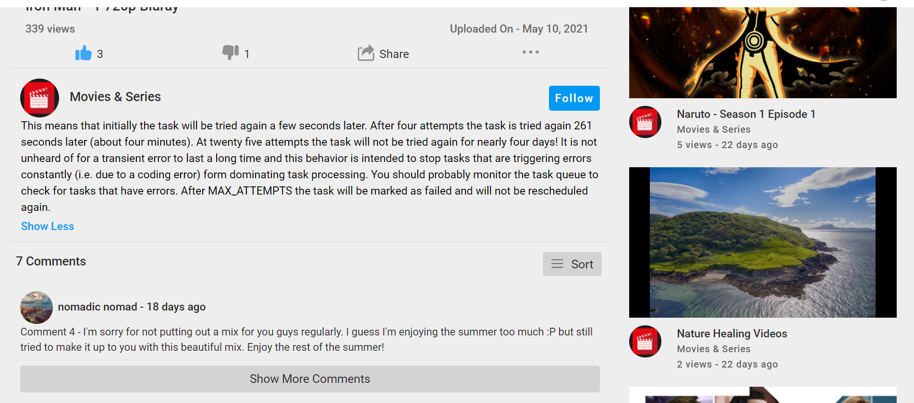
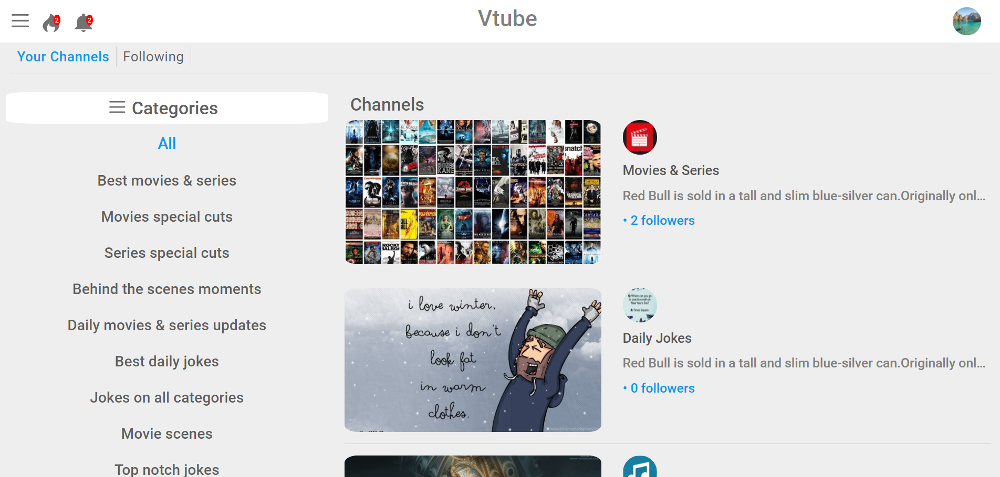
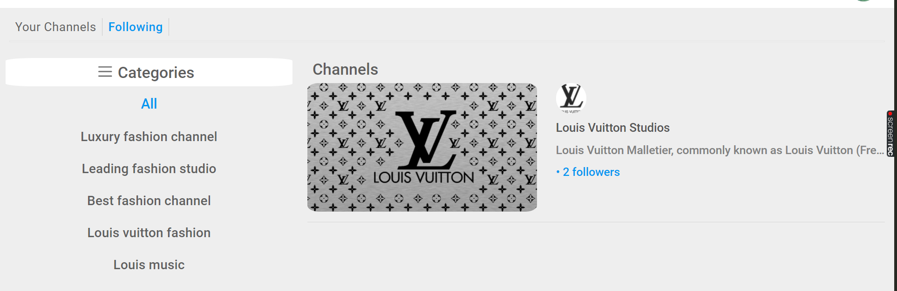
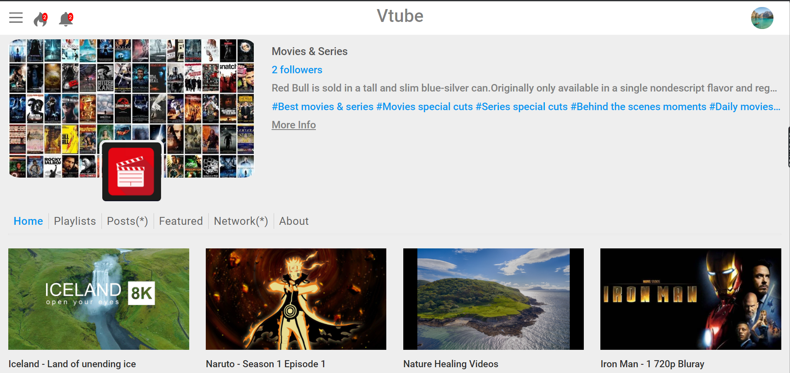
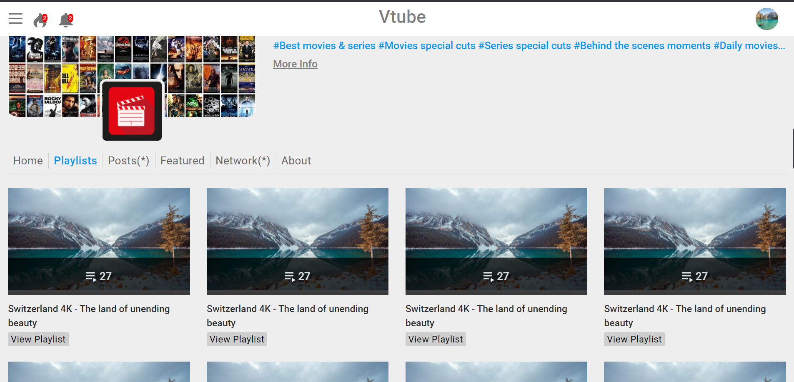
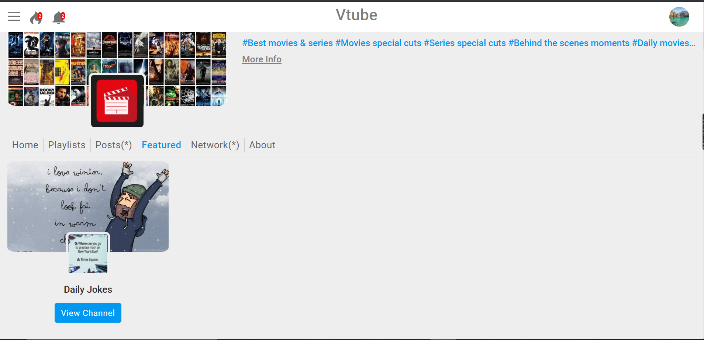
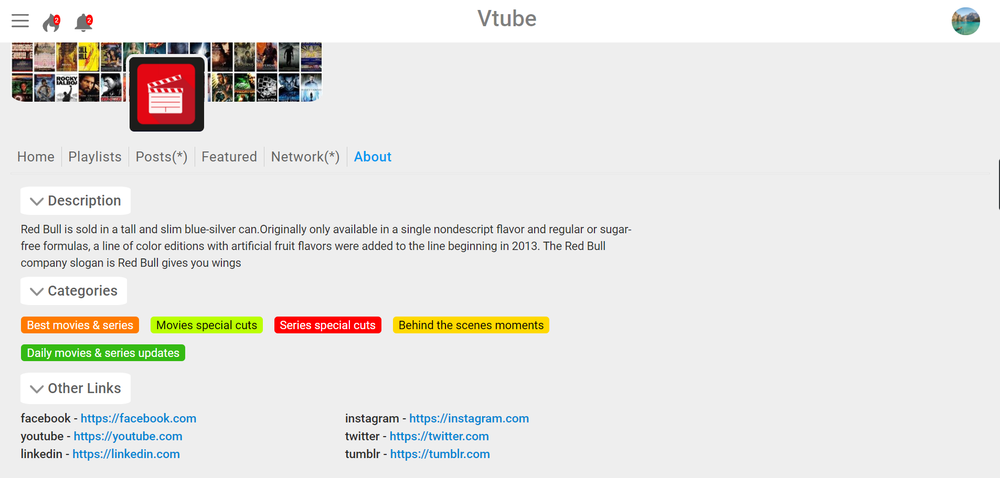
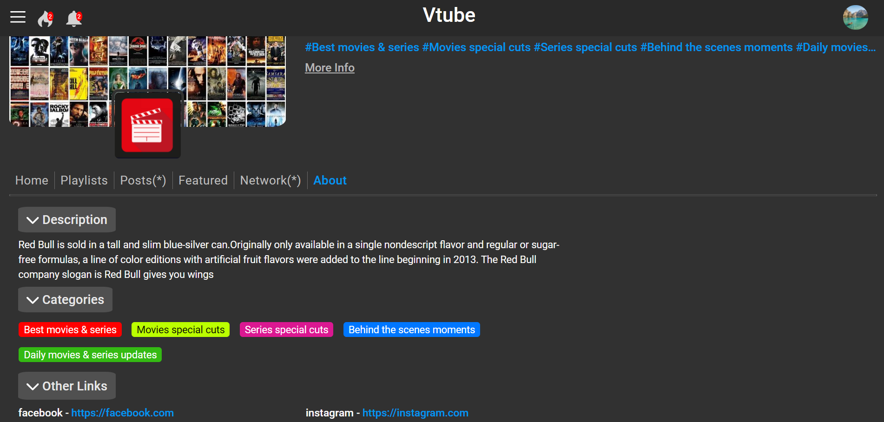

<!-- Adding extra option in sorting comments which were cancelled-->
<!-- Adding extra option in sorting comments -->

**This is a hobby project built by me in 2 months to improve my frontend skills**

This is the frontend for Vtube a very very basic version of video streaming platform

The backend for this is built using Django. The backend is a private repo

**Fully Responsive** even on small screen like **iPhone 5/SE**

Snapshots in case the site is down due to some reason

#### Specific video

Play Specific Video

Comments Section

#### Your Channels

View your created channels

#### Following Channels

Channels which you follow

#### Channels page

#### 1. Videos uploaded by a channel

#### 2. Playlists created by a channel

#### 3. Channels featured by a channel

#### 4. Channel's about section

There is also a dark mode for many of the pages

Visit the demo on **<a href="http://streamvidzz.ml/videos" target="_black">http://streamvidzz.ml/videos</a>**
